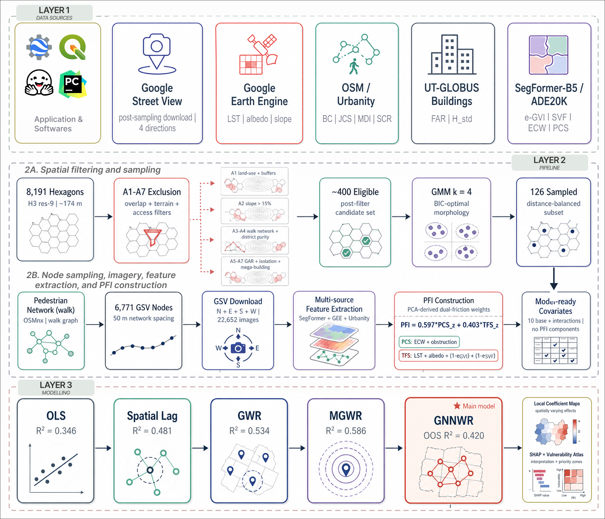

# Dual Friction Mapping of Urban Pedestrian Spaces

[](#repository-status)
[](#study-area)
[](#analytical-workflow)
[](LICENSE)
[](docs/data_availability.md)

This repository accompanies the manuscript:

> **Dual Friction Mapping of Urban Pedestrian Spaces: Integrating Street-View Visual Analytics and Geographically Neural Network Weighted Regression in Izmir, Türkiye**

The project develops a sidewalk-level modelling framework for explaining spatial variation in pedestrian friction. The response variable is the **Pedestrian Friction Index (PFI)**, and the explanatory structure represents physical walking capacity, built-form intensity, network exposure, terrain effort, park access, and green-infrastructure buffering.

The repository is designed as a clean public companion package: it documents the workflow, provides curated reproducibility scripts, includes figure previews, and prepares the project for a future GitHub-Zenodo release.



## Why This Study Matters

Pedestrian planning is often evaluated through broad walkability or accessibility scores. Those scores are useful, but they can hide the local mechanisms that make walking difficult: narrow effective walking space, street furniture, vehicle occupation, canyon-like built form, heat exposure, weak green buffering, difficult slopes, and network pressure.

This study treats pedestrian friction as a **modelled urban-environment outcome** rather than only as a ranking index. The central question is:

```text
Why do some sidewalk-level locations produce higher pedestrian friction than others?
```

The modelling logic is:

```text
PFI = f(pedestrian-space capacity,
        urban morphology,
        network exposure,
        terrain effort,
        green-infrastructure buffering,
        local spatial interactions)
```

That framing supports diagnosis-specific planning: some places require physical accessibility improvements, some require shade and heat mitigation, and some require both.

## Study Area

The empirical setting is the functional urban area of **Izmir, Türkiye**, focusing on 11 districts: Balçova, Bayraklı, Bornova, Buca, Çiğli, Gaziemir, Güzelbahçe, Karabağlar, Karşıyaka, Konak, and Narlıdere.


## Analytical Workflow

The full research pipeline combines spatial sampling, computer vision, urban morphology, thermal remote sensing, network analytics, and spatially varying modelling.

| Stage | Purpose | Public repository status |
|---|---|---|
| Hexagonal sampling frame | Build H3 sampling units and apply eligibility filters | documented |
| Morphological clustering | Identify urban-form strata using Gaussian mixture modelling | documented |
| Spatial sampling | Select sampled hexagons with spacing constraints | documented |
| Street-view nodes | Generate sidewalk-level sampling locations | metadata planned |
| Visual metrics | Derive GVI, SVF, obstruction, and effective walking-space proxies | derived metrics planned |
| Geospatial metrics | Integrate thermal, terrain, morphology, park, and network indicators | derived metrics planned |
| PFI construction | Build the node-level response variable | code included |
| Model matrix preparation | Assemble predictors and interaction terms | code included |
| Benchmark modelling | Estimate OLS-style baseline diagnostics | code included |
| Sensitivity analysis | Evaluate PFI weight and ranking stability | code included |

## Repository Structure

```text
pfi_paper/
├── README.md
├── LICENSE
├── CITATION.cff
├── .zenodo.json
├── .env.example
├── data/
│   └── README.md
├── docs/
│   ├── data_availability.md
│   ├── reproducibility.md
│   └── zenodo_workflow.md
├── figures/
│   ├── fig01_methodological_framework.png
│   ├── fig02_study_area_sampling_design.png
│   └── README.md
├── metadata/
│   └── variable_dictionary.csv
├── scripts/
│   ├── 01_validate_inputs.py
│   ├── 02_build_model_matrix.py
│   ├── 03_run_baseline_models.py
│   └── 04_run_pfi_sensitivity.py
├── src/
│   └── pfi_pipeline/
│       ├── __init__.py
│       ├── config.py
│       ├── io.py
│       ├── pfi.py
│       ├── diagnostics.py
│       └── modelling.py
└── workflow/
    └── pipeline_manifest.yml
```

## Quick Start

The current public repository does not include the restricted raw imagery or full processed dataset. The scripts are written so that the future processed release can be placed under `data/processed/`.

```bash
python -m venv .venv
.venv\Scripts\activate
pip install -r requirements.txt
python scripts/01_validate_inputs.py
python scripts/02_build_model_matrix.py
python scripts/03_run_baseline_models.py
python scripts/04_run_pfi_sensitivity.py
```

Expected future processed inputs:

```text
data/processed/pfi/pfi_merged.csv
```

Expected generated public outputs:

```text
outputs/public/model_matrix.csv
outputs/public/baseline_metrics.csv
outputs/public/sensitivity_summary.csv
```

## Included Scripts

The included scripts are curated for public release. They avoid API calls and do not download or redistribute Google Street View imagery.

| Script | Role |
|---|---|
| `01_validate_inputs.py` | Checks that required processed metrics are available and reports missing fields. |
| `02_build_model_matrix.py` | Builds the analytical model matrix and interaction terms from processed node metrics. |
| `03_run_baseline_models.py` | Runs transparent OLS-style baseline diagnostics for the PFI response. |
| `04_run_pfi_sensitivity.py` | Runs Monte Carlo sensitivity checks for PFI component weighting and rank stability. |

The end-to-end private pipeline contains additional data acquisition, Google Earth Engine, image download, semantic segmentation, and figure-production scripts. Those scripts require further cleaning before release because they interface with credentials, third-party imagery, large intermediate files, and journal production materials.

## Data Availability

Processed data, code, and reproducible analysis scripts will be deposited in this GitHub repository and archived through Zenodo upon publication. Raw Google Street View imagery is subject to third-party licensing restrictions and will not be redistributed publicly; derived metrics and image metadata will be provided, and additional research materials may be made available from the corresponding author upon reasonable request.

See [docs/data_availability.md](docs/data_availability.md) for details.

## Repository Status

This is a **pre-publication public companion repository**. It is intentionally structured to be useful but safe:

- no API keys or tokens,
- no raw Google Street View images,
- no submitted manuscript source files,
- no journal PDFs,
- no local cache/log files,
- no private paths or workstation-specific configuration.

After publication, this repository can be expanded with the finalized processed dataset, locked environment file, additional figure scripts, and a Zenodo DOI.

## Authors

| Author | Affiliation | Profiles |
|---|---|---|
| **Yusuf Eminoğlu** | Department of City and Regional Planning, Dokuz Eylül University; LUQAA - Lab of Urban Analytics and Quantitative Analysis | [](https://github.com/YusufEminoglu) [](https://orcid.org/0009-0005-6000-2934) [](https://www.researchgate.net/profile/Yusuf-Eminoglu?ev=hdr_xprf) [](https://avesis.deu.edu.tr/yusuf.eminoglu) |
| **Kemal Mert Çubukçu** | Department of City and Regional Planning, Dokuz Eylül University; Founder, LUQAA - Lab of Urban Analytics and Quantitative Analysis | [](https://orcid.org/0000-0003-3604-7014) [](https://www.researchgate.net/profile/K-Mert-Cubukcu) [](https://avesis.deu.edu.tr/mert.cubukcu) |

## Citation

A formal citation will be added after publication. For now, please cite the repository metadata in [CITATION.cff](CITATION.cff) when referring to this public companion package.

## License

Code in this repository is released under the MIT License. Data, figures, and derived metrics may be released under separate terms after publication, depending on journal policy and third-party data restrictions.

